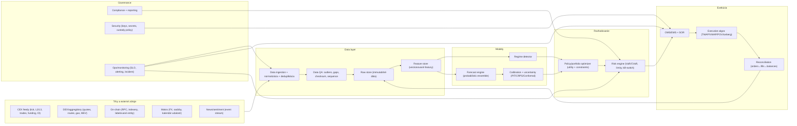

# Autonomous Investment Robot (Paper-First, Deterministic MVP+)

Safe-first autonomous crypto robot scaffold with deterministic replay, OMS lifecycle, portfolio risk guardrails, reconciliation hard-stop, and offline paper execution.

## Why paper run previously vetoed
Compliance required an authorized provider and whitelist was empty. The provided `config.paper.yaml` now includes `paper_sim_provider`, so paper runs pass compliance gate.

## HARD safety invariants
- safe-mode default supported (`safe_mode_default=true` blocks trading)
- no-trade if required limits are missing / `UNSPECIFIED`
- integrity kill path (stale/liq hole/spread explosion/reconciliation mismatch)
- live trading hard-blocked unless: `ENABLE_LIVE_TRADING=true` + `ACK_I_UNDERSTAND_RISKS=true` + `CANARY_MODE=true` + complete risk limits
- no secrets in repo

## One-command local flow
```bash
make up
make init
make paper
```

## Commands
```bash
# infra
docker compose -f infra/docker-compose.yml up -d
./scripts/init_db.sh

# paper run (offline fixtures)
PYTHONPATH=src python scripts/run_paper.py --config config.paper.yaml

# deterministic replay CLI
PYTHONPATH=src python -m autonomous_investment_robot replay --config config.paper.yaml --source fixtures

# tests
pytest -q
```

## Outputs (`runs/latest`)
- `order_plans.json`, `fills.json`, `report.json`, `checksums.json`
- `events_*.jsonl` immutable event streams (market/orders/fills/risk/compliance/positions)
- `metrics.prom` Prometheus export
- `audit.log`, `config_history.jsonl`

## Monitoring
- Prometheus: http://localhost:9090
- Grafana: http://localhost:3000
- Alert rules: `infra/alerts/alerts.yml`
- Dashboard: `infra/grafana/dashboards/autobot.json`

## Mermaid architecture (required)

