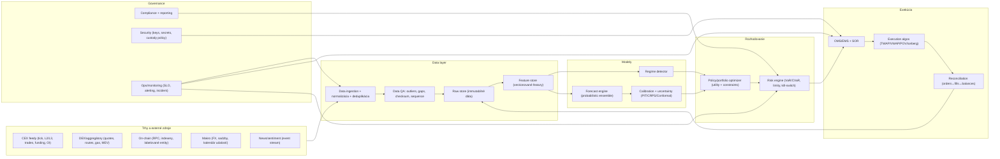
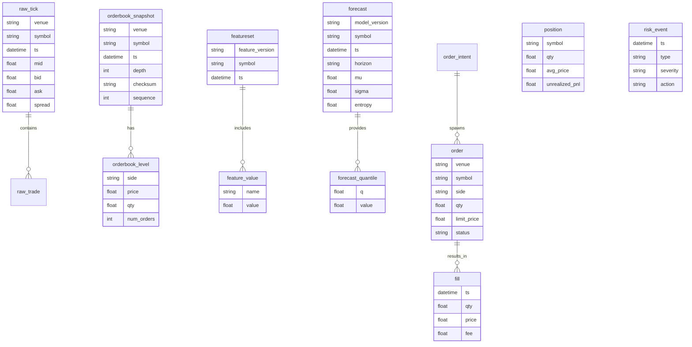
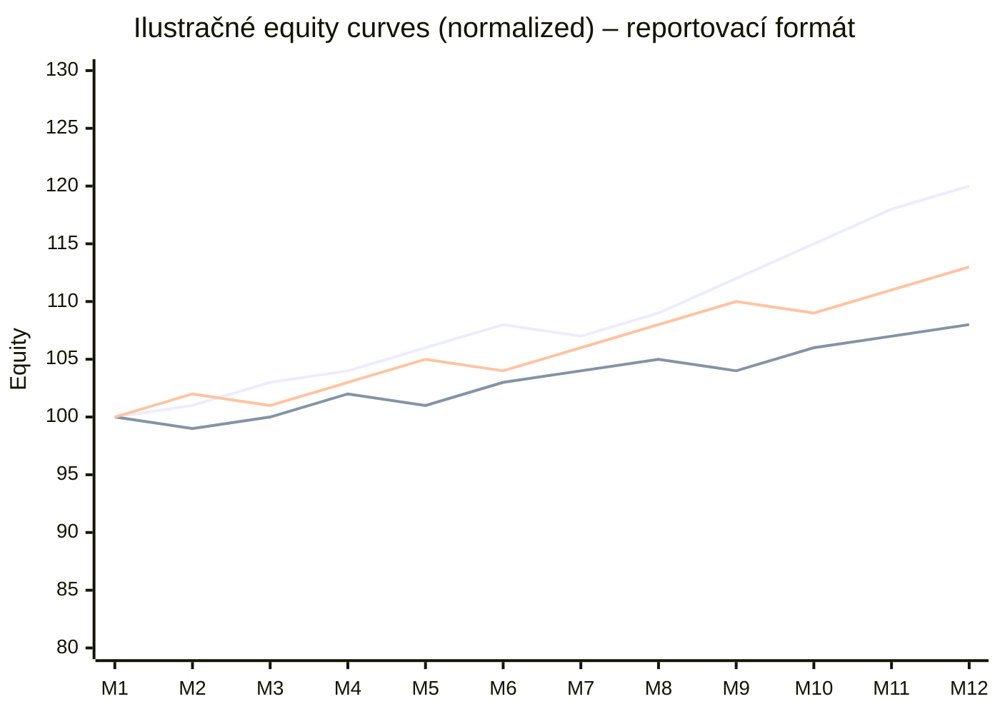
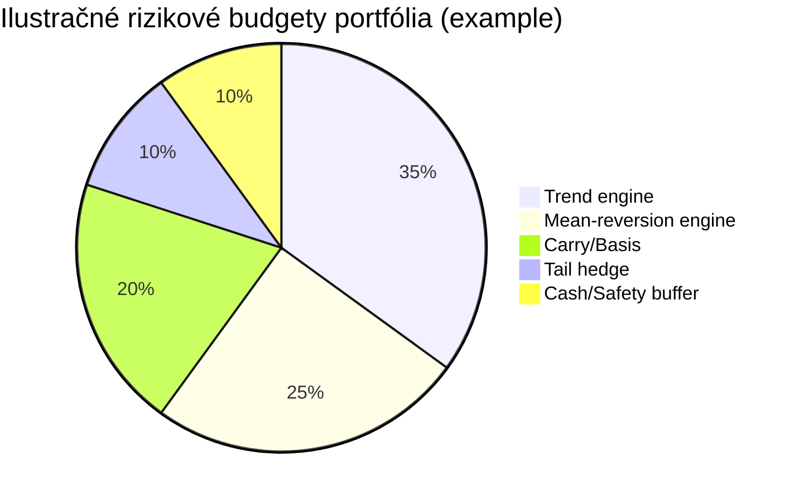
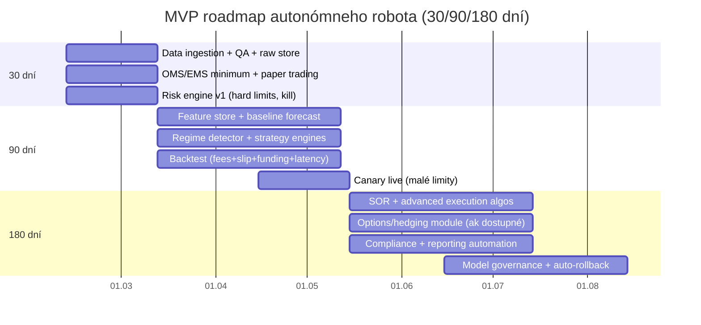

# Autonomous Investment Robot for Crypto Markets (Safe-First Scaffold)

Production-grade **modular** architecture scaffold for a 24/7 autonomous crypto trading system with deterministic risk controls, compliance veto, and paper-trading default.

## Safety and non-goals
- Default mode is **SAFE_MODE + paper trading**.
- Live trading is blocked unless explicit live enable + mandatory risk limits are set.
- No promise of profits.
- No live self-rewriting models.
- No market manipulation or exchange rule bypass.

## Architecture

## Data model

SQL DDL is in `sql/schema.sql`.

## Service boundaries
- `data_ingestion`: streaming + polling fallback, stale flag hooks.
- `data_qa`: checksum/sequence/gap guards.
- `raw_store`: immutable object + append-only interface.
- `feature_store`: versioned feature vectors + leakage lock.
- `models`: probabilistic forecasts/regime/calibration placeholders.
- `policy`: utility-based target sizing (`position_size ∝ risk_budget / σ_h`).
- `risk_engine`: hard limits + deterministic kill-switch state.
- `execution`: pre-trade checks + paper/live mode separation.
- `reconciliation`: orders/fills/balances consistency.
- `compliance`: MiCA/Travel Rule hooks and provider authorization veto.
- `security`: no-withdrawal + IP allowlist checks.
- `ops`: alerts, metrics, audit events, rollback hook surface.

## Connectors implemented (skeletons + config stubs)
- CEX/derivatives: Binance, Coinbase, Kraken, OKX, Bybit, Deribit, Hyperliquid.
- DEX/on-chain: 0x, 1inch, Uniswap, The Graph, Dune, Glassnode, Nansen.
- RPC/anchors: Alchemy, Infura, Chainlink.
- Macro/news: ECB Data Portal API, FRED, GDELT.
- Normalized optional adapters: CoinAPI, Kaiko, CoinGecko.

## Compliance and EU controls
- MiCA-aware provider authorization gate (configurable register URL and whitelist).
- Transitional/national rules can be represented via provider policy lists.
- Travel Rule support hook for transfer metadata workflow.
- Hard veto path: unauthorized provider => no-trade/restricted mode.

## Risk and kill-switch
- Config placeholders marked `UNSPECIFIED`; live mode validation rejects missing mandatory limits.
- Deterministic blocks include safe-mode default, integrity failures, and missing limits.
- Continuous metrics scaffolding: VaR/CVaR/exposure/liquidity/correlation limits are configurable and intentionally UNSPECIFIED until set by operator.

## Infra stack (local dev)
`infra/docker-compose.yml` provides NATS, Redis, Postgres, ClickHouse, MinIO, Prometheus, Grafana.

## Running locally (paper mode)
1. `python -m venv .venv && source .venv/bin/activate`
2. `pip install -e . pytest`
3. `cp .env.example .env` and keep paper defaults.
4. `python scripts/run_paper.py`
5. `pytest`

## Live mode guardrail
Live mode requires all of:
- `ROBOT_TRADING_MODE=live`
- `ROBOT_EXPLICIT_LIVE_ENABLE=true`
- Mandatory risk limits explicitly set (not `UNSPECIFIED`)
- Authorized provider policy configured

## Reporting format examples

## MVP roadmap

## External keys/env stubs
See `.env.example` for required variable names. Proprietary/licensed providers remain optional and configurable.
